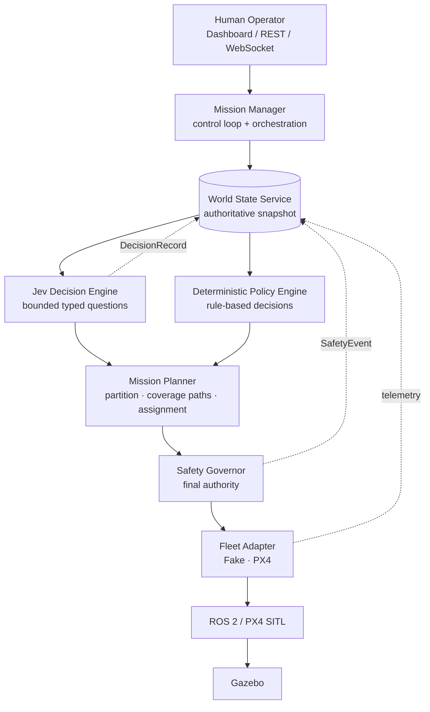
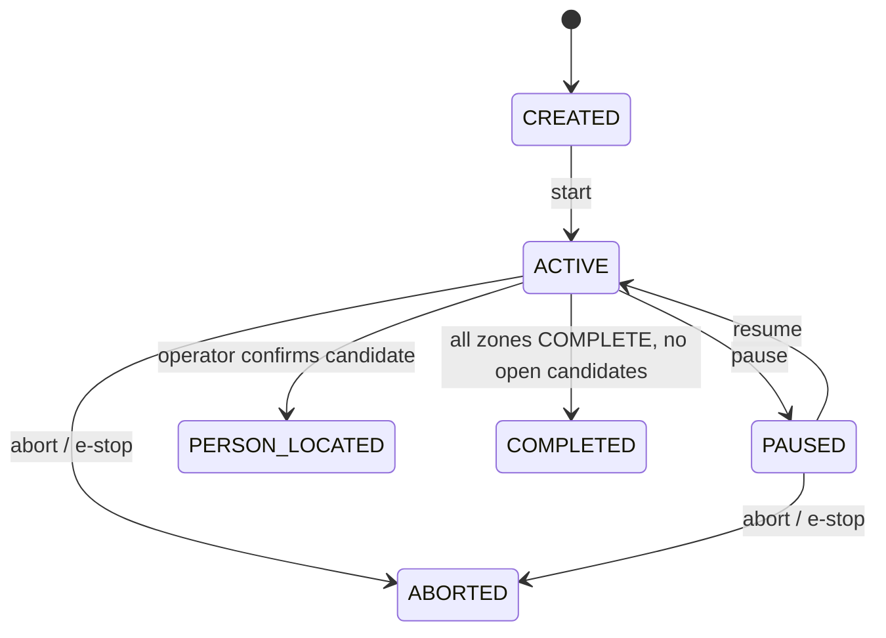
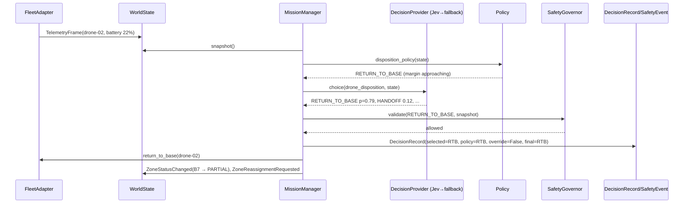

# AERIS Architecture

AERIS is a decision and coordination layer for civilian multi-drone search-and-rescue. This
document describes the system's components, the data that flows between them, and the
reasoning behind the major structural choices. It is the reference for anyone adding a
component or changing a boundary.

Scope note: AERIS is a civilian rescue research project. It contains no weapons, targeting,
fire-control, attack, or engagement functionality, and never will. Person detection exists
only to locate people who may need rescue. See `docs/safety.md` and `CONTRIBUTING.md`.

## 1. Layered view



Three kinds of intelligence share this diagram, and each has a fixed place:

| Layer | Kind | Authority |
|---|---|---|
| Safety Governor | deterministic code | absolute; can block or replace any action |
| Mission Planner | algorithms | produces concrete plans from decisions |
| Jev / Policy Engine | bounded AI / rules | produces *proposals* only |
| Human operator | human | can pause, abort, confirm, reject, e-stop at any time |

## 2. Components

### 2.1 Domain model (`backend/aeris/domain/`)

Pure Pydantic v2 models and enums with no I/O and no ROS/PX4/framework imports. This is the
vocabulary every other module speaks.

| Model | Purpose |
|---|---|
| `Mission` | id, name, status, search area, base position, fleet, created/started/completed times |
| `SearchArea` | operator-defined polygon (WGS84), search altitude, camera footprint, overlap |
| `SearchZone` | zone_id, polygon, priority, coverage, assigned drone, status, last searched, detections |
| `Drone`, `DroneCapability` | static identity and sensors (camera, thermal), endurance, speed |
| `DroneState` | latest known dynamic state with an explicit `timestamp` |
| `TelemetryFrame` | one raw telemetry sample as delivered by an adapter |
| `Detection`, `DetectionObservation` | a sensor hit and each individual observation of it |
| `CandidateSurvivor` | an escalated detection awaiting human confirmation |
| `DecisionRecord` | audit record for one AI-assisted decision (§5) |
| `MissionAssignment` | drone ↔ zone ↔ task (SEARCH / INVESTIGATE / RETURN / HOLD) |
| `WaypointPlan` | ordered waypoints with altitude and speed for one assignment |
| `SafetyEvent` | audit record for one Safety Governor block or override (§6) |
| `OperatorAction` | a human command, recorded like any other event |

Key enums: `MissionStatus`, `DroneStatus`, `LinkState`, `ZoneStatus`, `Disposition`,
`TriageDecision`, `DetectionSource`.

Mission status lifecycle:



### 2.2 Event bus (`backend/aeris/events/`)

An in-process `asyncio` publish/subscribe bus with typed domain events. Services never call
each other's internals; they publish events and subscribe to the ones they care about. The
bus is an abstraction (`EventBus` protocol) so a broker can replace it later without touching
application logic. Events are also the feed for the WebSocket stream and the persisted event
log.

Initial event catalogue:
`MissionCreated`, `MissionStarted`, `MissionPaused`, `MissionAborted`, `MissionCompleted`,
`DroneRegistered`, `TelemetryReceived`, `DroneLinkStateChanged`, `DroneDisconnected`,
`DroneReturning`, `ZoneAssigned`, `ZoneCoverageUpdated`, `ZoneStatusChanged`,
`ZoneReassignmentRequested`, `DetectionCreated`, `DetectionUpdated`, `CandidateEscalated`,
`DecisionRequested`, `DecisionCompleted`, `SafetyOverrideTriggered`, `HumanReviewRequested`,
`SurvivorConfirmed`, `SurvivorRejected`, `OperatorActionReceived`.

### 2.3 World State Service (`backend/aeris/world/`)

The single authoritative, in-memory picture of a mission: fleet states, zones and coverage,
detections and candidates, assignments, link states, and the operator action log. It is
updated only through events and adapter telemetry, and read only through immutable
**snapshots** (`WorldSnapshot`). Every decision, plan, and safety check operates on a snapshot
taken at a known time, so the inputs to any action can be reconstructed later.

Staleness is explicit. Each `DroneState` carries the timestamp of the telemetry it came from,
and the service derives link state from age:

| Telemetry age | LinkState |
|---|---|
| ≤ `link_degraded_after_s` | `CONNECTED` |
| ≤ `link_stale_after_s` | `DEGRADED` |
| ≤ `link_lost_after_s` | `STALE` |
| > `link_lost_after_s` | `LOST` |

Missing information is never interpreted as "normal". A drone with no telemetry is not
available for assignment.

### 2.4 Decision engine (`backend/aeris/decisions/`)

```python
class DecisionProvider(Protocol):
    async def choice(self, request: ChoiceRequest) -> ChoiceResult: ...
    async def score(self, request: ScoreRequest) -> ScoreResult: ...
    async def probability(self, request: ProbabilityRequest) -> ProbabilityResult: ...
```

Three implementations share this interface:

| Provider | Behavior | Use |
|---|---|---|
| `MockDecisionProvider` | deterministic, scriptable answers; optional seeded randomness | tests, CI, offline demos |
| `RuleBasedDecisionProvider` | hand-written heuristics | fallback, baseline for evaluation |
| `JevDecisionProvider` | calls TypeSafe AI's Jev System One via `TYPESAFE_API_KEY` / `JEV_MODEL` | production decisions |

On top of the primitives sit four **decision modules**, each a narrow typed question with a
small input model, a bounded output, and an accompanying deterministic policy opinion:

| Module | Primitive | Output | Deterministic guard |
|---|---|---|---|
| `drone_disposition` | choice | `CONTINUE_SEARCH · RETURN_TO_BASE · HANDOFF_ZONE · HOLD · REQUEST_HUMAN_REVIEW` | mandatory return thresholds are code; Jev may only recommend an *earlier* return |
| `detection_triage` | choice | `IGNORE · RECHECK · INVESTIGATE · HUMAN_REVIEW · POSSIBLE_SURVIVOR` | may never mark a person as *found*; `POSSIBLE_SURVIVOR` always requires human confirmation |
| `zone_priority` | score | bounded priority in `[0, 1]` | consumed as one weight among several by deterministic assignment |
| `human_review_gate` | probability | P(human review needed) | thresholded by config; conflicts, poor link, sensor disagreement raise it |

Jev receives a compact structured JSON state, never free text about the whole fleet, and never
raw telemetry streams. See `docs/jev.md` for exact payloads.

**Resilience.** `ResilientDecisionProvider` wraps the primary provider with a per-call
timeout, a small bounded retry, a circuit breaker, and a fallback provider (default:
`RuleBasedDecisionProvider`). Failures are structured errors that appear in the resulting
`DecisionRecord` (`provider="rules"`, `fallback_reason="timeout"`). Jev being unavailable
never prevents safety behavior because safety behavior does not depend on Jev.

### 2.5 Mission Planner (`backend/aeris/planning/`)

Deterministic, testable algorithms:

- **Partitioning** — `GridPartitioner` splits the search polygon into a grid of `SearchZone`s
  clipped to the polygon. Interface allows terrain-aware or Voronoi partitioners later.
- **Coverage paths** — `BoustrophedonPlanner` turns a zone polygon, search altitude, camera
  footprint, and overlap into a `WaypointPlan`. Supports resuming from a fraction complete so a
  `PARTIAL` zone can be handed off without re-flying searched ground.
- **Assignment** — `AssignmentStrategy` protocol; MVP ships `GreedyAssignmentStrategy`, a
  weighted greedy over distance, battery, availability, workload, zone priority (optionally
  Jev-scored), and sensor capability. Hungarian and auction strategies are planned.
- **Dynamic reassignment** — when a zone becomes `PARTIAL` (drone returning, reassigned to
  investigate, or lost), the planner computes the remaining region and reruns assignment for
  it. Example: drone-02 at 19% battery with zone B7 at 58% → Safety Governor orders return →
  B7 becomes PARTIAL → remaining B7 region assigned to drone-01 → search continues.

### 2.6 Safety Governor (`backend/aeris/safety/`)

```python
proposal  = decision_engine.propose(snapshot)
validated = safety_governor.validate(proposal, snapshot)
if validated.allowed:
    mission_planner.execute(validated.proposal)
else:
    mission_planner.execute(validated.safe_alternative)
```

Authoritative, deterministic, and last in the chain before an adapter. Every action from any
source (Jev, policy, planner, operator) passes through it. Rules are small, independently
tested classes composed by the governor:

battery mandatory-return and critical-battery · maximum altitude · geofence boundary ·
restricted regions · minimum separation · telemetry timeout · invalid coordinates ·
unavailable drone · unreachable waypoint · mission cancelled/paused · operator emergency stop.

Every block or replacement emits a `SafetyEvent` (rule, original proposal, safe alternative,
snapshot hash). Lost-link behavior (`CONNECTED → DEGRADED → LOST → preconfigured safe
behavior`, MVP default: return to base) is governed here and is never delegated to Jev.

### 2.7 Fleet adapters (`backend/aeris/fleet/`)

```python
class FleetAdapter(Protocol):
    async def get_telemetry(self) -> list[TelemetryFrame]: ...
    async def send_mission(self, drone_id: str, plan: WaypointPlan) -> CommandResult: ...
    async def return_to_base(self, drone_id: str) -> CommandResult: ...
    async def hold(self, drone_id: str) -> CommandResult: ...
```

| Adapter | Status | Notes |
|---|---|---|
| `FakeFleetAdapter` | **simulated** | kinematic drones flying waypoint plans, battery drain, configurable link degradation and sensor events driven by scenario files. Runs a full mission with no ROS/PX4. |
| `PX4FleetAdapter` | **planned (Phase 4)** | talks to the `aeris_px4_bridge` ROS 2 node; maps `drone-01 ↔ PX4 system 1` etc. explicitly. |

Both adapters expose the same interface, so `MissionManager`, planning, decisions, and safety
are identical in both cases. The adapter is the only place PX4 message shapes exist on the
Python side.

### 2.8 Mission Manager (`backend/aeris/mission/`)

The orchestrator and control loop. On each tick it: pulls telemetry from the adapter and
publishes `TelemetryReceived`; takes a `WorldSnapshot`; derives link states; evaluates every
active drone through the disposition module (Jev or policy) and the Safety Governor; evaluates
new detections through triage; runs assignment for any unassigned or partial zones; sends
validated commands through the adapter; and records `DecisionRecord`s and `SafetyEvent`s.
Operator actions arrive as events and are applied on the next tick, except emergency stop
and abort which are applied immediately.

### 2.9 API and dashboard (`backend/aeris/api/`, `dashboard/`)

REST (`/api/v1/missions…`, `/detections/{id}/confirm|reject`, `/drones/{id}/return|hold`) plus a
WebSocket that streams domain events. The Next.js dashboard renders the live map (MapLibre),
fleet panel, coverage, event log, and the **Decision Inspector** — a view of every
`DecisionRecord` showing what Jev saw, what it answered with probabilities, what the policy
said, whether safety overrode it, and the final action.

### 2.10 Persistence, telemetry, evaluation

- **Persistence** (`persistence/`): SQLAlchemy async + PostgreSQL/PostGIS for missions, zones,
  detections, decisions, safety events, and the event log. The in-memory World State is the
  live source of truth; the database is the durable record for replay and evaluation.
- **Telemetry** (`telemetry/`): structured JSON logging with `mission_id`, `drone_id`,
  `event_type`, `decision_id`, `provider`, `model`, `latency_ms`; a metrics registry
  (counters/gauges/histograms) designed so a Prometheus exporter can attach later.
- **Evaluation** (`evals/`, `aeris eval`): replays recorded snapshots or scenarios through
  any provider and writes JSON comparing decisions, latency, cost, safety overrides,
  outcomes, coverage, completion time, and human interventions.

## 3. Data flow for one decision



If Jev had answered `CONTINUE_SEARCH` while battery was below the mandatory return threshold,
the governor would replace it with `RETURN_TO_BASE`, set `safety_override=True`, and emit a
`SafetyEvent`. The DecisionRecord keeps both the AI answer and the executed action.

## 4. Simulation

Simulation is first-class. `sim/scenarios/*.yaml` describe fleet, search area, base, missing
person location, and timed events (battery anomaly, thermal candidate, link loss, drone
failure). The `FakeFleetAdapter` and a `ScenarioRunner` consume them; nothing about the
scenario is hardcoded in application logic. Scenarios: `basic_search`, `low_battery`,
`candidate_detection`, `lost_connection`, `drone_failure`, `dynamic_reassignment`,
`multiple_detections`, and the headline `forest_search` (1 km² region, 3 drones, one missing
person, scripted timeline from T+0 to operator confirmation at T+9 min). See
`docs/simulation.md`.

PX4 SITL + Gazebo (Phase 4) run in Docker under `docker compose --profile px4`; the same
scenarios drive detection and event injection while flight comes from PX4.

## 5. Decision recording

Each AI-assisted decision yields a `DecisionRecord` with: id, timestamp, mission_id,
drone_id, decision_type, provider, model, input_state (compact) and input_state_hash,
selected_value, probabilities/score, latency_ms, token usage and estimated cost when known,
policy_value, safety_override flag, safety_event_id, final_action, fallback_reason, and an
optional outcome link filled in later. This answers: what did Jev see, what did it decide,
how certain was it, which model, what did policy say, did safety override it, what ran, and
what happened next.

## 6. Safety model summary

- Safety Governor is last and authoritative; every action passes through it.
- Hard limits are code with named thresholds in configuration, never model outputs.
- Missing/stale data is unsafe by default; lost link triggers preconfigured behavior.
- AI never declares a survivor found; humans confirm.
- Operators can pause, abort, hold, return, or e-stop at any time.
- Simulation is the default; real aircraft require an explicit switch and are out of MVP scope.
- No weaponization or offensive targeting, ever.

Full detail in `docs/safety.md`.

## 7. Design rationale

**Why Jev?** Detection triage, zone prioritization, and borderline disposition calls are
context-dependent judgments where rule tables grow brittle. A bounded decision model answering
typed questions gives adaptable judgment while keeping outputs enumerable, loggable, and
comparable against a rule baseline.

**Why not use Jev for navigation?** Navigation is a solved, verifiable algorithmic problem
with hard safety constraints. Coverage paths and assignments must be deterministic, testable,
and explainable, and a model in the flight loop would add latency, cost, and unbounded risk.

**Why PX4?** Mature open-source autopilot with multi-vehicle SITL, Gazebo integration, and a
ROS 2 bridge (uXRCE-DDS). It lets AERIS stay a coordination layer.

**Why simulation first?** Contributors without hardware or a robotics environment can run,
test, and demo the full system; CI is deterministic; safety logic is exercised thousands of
times before any real flight.

**Why an in-process event bus?** It decouples services now without infrastructure. A broker
can be swapped in later behind the same protocol.

**Why a separate policy engine alongside Jev?** It provides the fallback, an evaluation
baseline, and a second opinion recorded on every decision.

## 8. Phase map

| Phase | Delivers |
|---|---|
| 0 | this document, CLAUDE.md, README, skeleton, environment |
| 1 | domain, events, world state, FakeFleetAdapter, grid, coverage, greedy assignment, REST + WS, basic dashboard: three fake drones search a region |
| 2 | Mock/RuleBased/Jev providers, decision modules, DecisionRecord, resilience, inspector |
| 3 | Safety Governor and rules, operator overrides, dynamic reassignment |
| 4 | ROS 2 / PX4 SITL / Gazebo, PX4FleetAdapter, 3 vehicles |
| 5 | detection simulation, complete forest-search scenario |
| 6 | evaluation harness, docs, screenshots, contributor experience |
