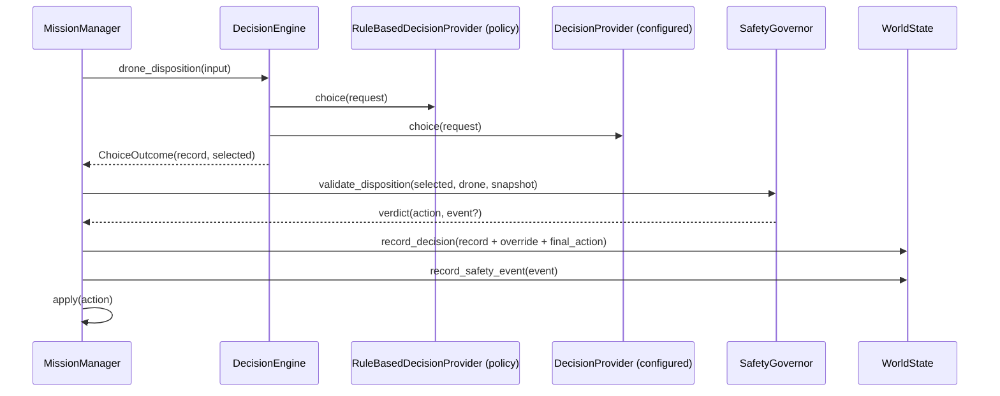

# Decisions

How a bounded decision moves through AERIS, and how to read the record it leaves behind.

## Pipeline

Order inside one Mission Manager tick:

1. telemetry → world state, link states derived from age
2. coverage advanced from position against each plan
3. zones released from drones that cannot work them
4. **dispositions**: each due searching drone is asked; each proposal validated
5. **safety enforcement**: rules run on every drone whether or not AI is configured
6. assignment, settling, completion

Step 5 exists so that a drone that was not asked this tick is still recalled the moment a
rule fires. The AI cadence is `AERIS_DECISION__DISPOSITION_INTERVAL_S` (default 15 s).

## Reading a DecisionRecord

| Field | Answers |
|---|---|
| `input_state`, `input_state_hash` | What did the model see? |
| `selected_value`, `probabilities` / `score` | What did it decide, how certain was it? |
| `provider`, `model`, `latency_ms`, `input_tokens`, `estimated_cost_usd` | Who answered, how fast, what did it cost? |
| `policy_value`, `policy_reason` | What did the deterministic policy say? |
| `fallback_reason` | Did the hosted provider fail and the fallback answer instead? |
| `safety_override`, `safety_event_id` | Did the Safety Governor replace the answer? Which rule? |
| `final_action` | What was executed? |
| `outcome` | Reserved for later linkage to what happened next |

`provider` is the provider that actually produced the answer. After a fallback it reads
`rules` with `fallback_reason` set, not `openrouter`.

## Safety Governor rules

The full state-rule and plan-rule tables live in `docs/safety.md`. For decisions the important
property is: a proposal that already satisfies the required action (or is more conservative
than a HOLD requirement) passes; anything else is replaced and produces a `SafetyEvent` whose
`proposed_action` is `<provider>:<proposal>`. Jev may recommend an *earlier* return but can
never delay a mandatory one.

## Zone priority in assignment

When open zones exist, the engine scores each one with the bounded `zone_priority` question
at most every `AERIS_DECISION__ZONE_PRIORITY_INTERVAL_S`. The score becomes the zone's
`priority`, one weighted term in the deterministic greedy assignment alongside distance,
battery and remaining work. The score never assigns anything by itself. Inputs include
coverage, time since last search, nearby candidate detections and distance from the mission's
`last_known_position`.

## Inspecting decisions

- Dashboard → bottom panel → **Decisions** tab. Click a row for input, probabilities, policy
  opinion, override rule and final action. Selecting a drone filters the list.
- `GET /api/v1/missions/{id}/decisions` and `GET /api/v1/missions/{id}/safety-events`.
- `aeris sim run --scenario low_battery` prints decision and override counts in its summary.

## Evaluation

`aeris eval` (Phase 6) replays scenarios through different providers and compares these
records. Because the record format is provider-independent, Jev, rules, and future models
are compared without changing mission logic.
